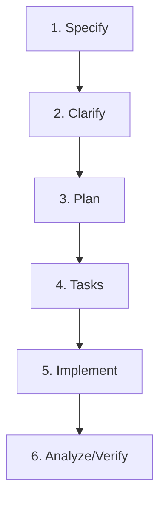

# Contributing to Countdown Timer

Thank you for your interest in contributing to the Countdown Timer! This project is designed to be highly agent-friendly and utilizes **Spec Kit (speckit)** to streamline the development lifecycle.

Whether you are a human developer pair-programming with an AI agent, or an autonomous coding agent, please follow the guidelines below to ensure code quality, compliance, and consistency with our project standards.

---

## 🛠 Project Constitution

All contributions MUST align with the **Project Constitution** located at [.specify/memory/constitution.md](file:///.specify/memory/constitution.md). Below is a summary of our core principles:

1.  **PWA & Offline-First Compliance**: The app MUST function fully offline. All static resources and assets MUST be cached via the Vite PWA service worker.
2.  **Responsive Layout & Device Compatibility**: The UI MUST adapt fluidly based on the aspect ratio (widescreen vs. mobile layouts) without breaking page layout.
3.  **URL-Driven Configuration**: The timer settings (duration, titles, cues, backgrounds) MUST be serialized directly into URL parameters/hash for instant, stateless shareability.
4.  **Robust Audio-Visual Cues & User Gates**: Cues MUST respect browser autoplay permissions and require user interaction before playing audio.
5.  **Strict Test Discipline**: Logic modifications MUST include Vitest unit/integration tests with high coverage (>90% on parser/core logic).

---

## 🤖 Spec Kit Workflow (for AI Agents & Developers)

This repository integrates **Spec Kit**, a structured toolset that drives feature creation through clear specification, design reviews, task generation, and verified execution. 

If you are using an AI agent (e.g., Cursor, Gemini, Claude, or other coding assistants), ensure the agent has access to the Spec Kit skills in [.agents/skills/](file:///.agents/skills/).

The standard workflow for proposing and implementing a new feature is divided into the following phases:



### Phase 1: Branch & Specify
Before starting, create a feature branch using the sequential naming format (e.g., `002-custom-soundtracks`).
*   **Command**: `/speckit-specify "Description of the feature..."`
*   **Artifact Created**: `specs/[###-feature-name]/spec.md`
*   **Action**: Captures user stories, acceptance criteria (Given-When-Then), and requirements.

### Phase 2: Clarification
Identify and resolve any underspecified requirements.
*   **Command**: `/speckit-clarify`
*   **Action**: The agent reviews the spec, asks up to 5 targeted clarifying questions, and encodes your answers back into the spec.

### Phase 3: Design & Planning
Draft the technical design and impact analysis before writing code.
*   **Command**: `/speckit-plan`
*   **Artifacts Created**: `specs/[###-feature-name]/plan.md` (which automatically checks constitution compliance), `research.md`, `data-model.md`, and `quickstart.md`.
*   **Action**: Reviews constraints, target files, and data model decisions.

### Phase 4: Task Checklist Generation
Generate a dependency-ordered checklists of implementation tasks.
*   **Command**: `/speckit-tasks`
*   **Artifact Created**: `specs/[###-feature-name]/tasks.md`
*   **Action**: Breaks down work into atomic steps grouped by user story (enabling incremental MVP verification).

### Phase 5: Implementation & Verification
Build and verify each user story incrementally.
*   **Command**: `/speckit-implement`
*   **Action**: The agent processes and checks off tasks in `tasks.md`, running Vitest test suites (`npm test`) to verify correctness.

### Phase 6: Analyze
Perform post-implementation validation.
*   **Command**: `/speckit-analyze`
*   **Action**: Performs consistency and quality checking across the spec, plan, and tasks files to ensure nothing was skipped.

---

## 🔧 Setup & Development Commands

Install the dependencies:
```bash
npm install
```

Run the hot-reloading development server locally:
```bash
npm run dev
```

Run the unit and integration tests:
```bash
npm test
```

Build the production bundle (generates optimized files under `dist/`):
```bash
npm run build
```

Preview the production build locally:
```bash
npm run preview
```

---

## 📝 Commit Guidelines

We use auto-commit hooks managed by Spec Kit (if enabled in [.specify/extensions/git/git-config.yml](file:///.specify/extensions/git/git-config.yml)). 
If you commit manually, follow the project's commit message conventions:
*   Features: `feat: add custom background options`
*   Bug fixes: `fix: resolve audio context initialization delay`
*   Documentation/Constitution: `docs: amend constitution to v1.0.0`
*   Testing: `test: add unit tests for parser utils`
