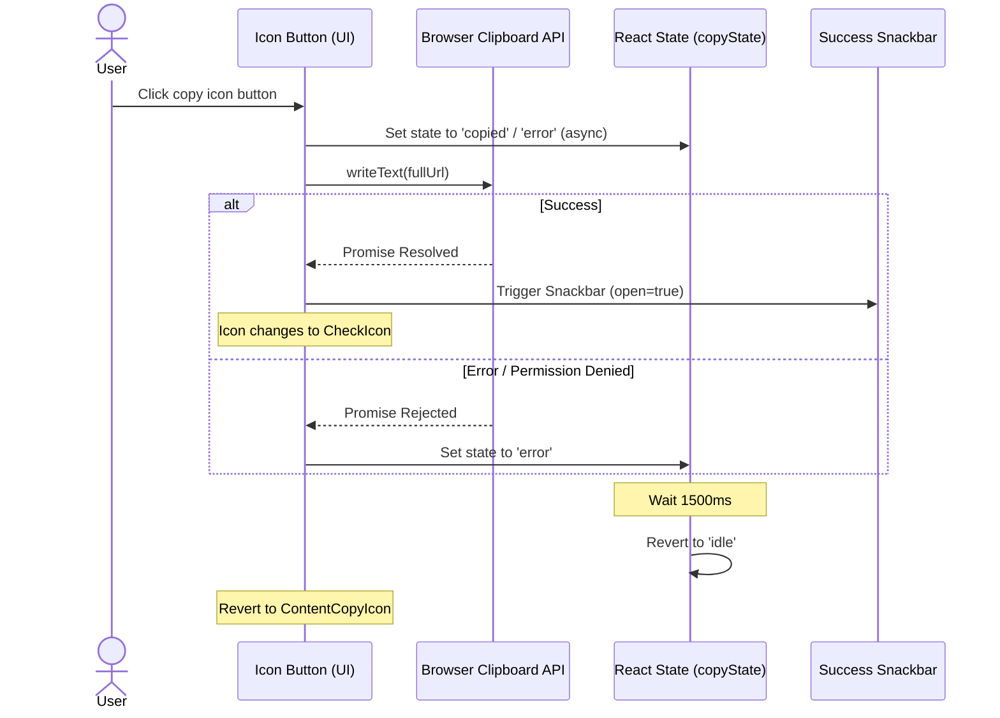

# UI Contract: Copy Timer Link Button

This contract defines the component interfaces, visual specs, and event boundaries for the copy link button.

## Component Contract

The copy action is integrated within the `TextField` component for the Shareable URL.

```typescript
interface CopyButtonContract {
  // Input props
  value: string;         // The generated full shareable URL to be copied
  disabled: boolean;     // Disabled when timer configuration is invalid (canStart is false)
  
  // State variables
  copyState: 'idle' | 'copied' | 'error';
  
  // Events
  onClick(): Promise<void>; // Triggers clipboard write and updates copyState
}
```

## Visual Specifications

- **Component Class**: Material UI `IconButton` wrapped in a `Tooltip`.
- **Icon Rendering**:
  - `copyState === 'copied'`: Render `<CheckIcon color="success" />`
  - `copyState !== 'copied'`: Render `<ContentCopyIcon />`
- **Tooltip Text**:
  - `copyState === 'copied'`: "Copied!"
  - `copyState !== 'copied'`: "Copy link to clipboard"
- **Placement**: Placed inside the `InputProps.endAdornment` slot of the "Shareable URL" `TextField` element.

## Event Flows


