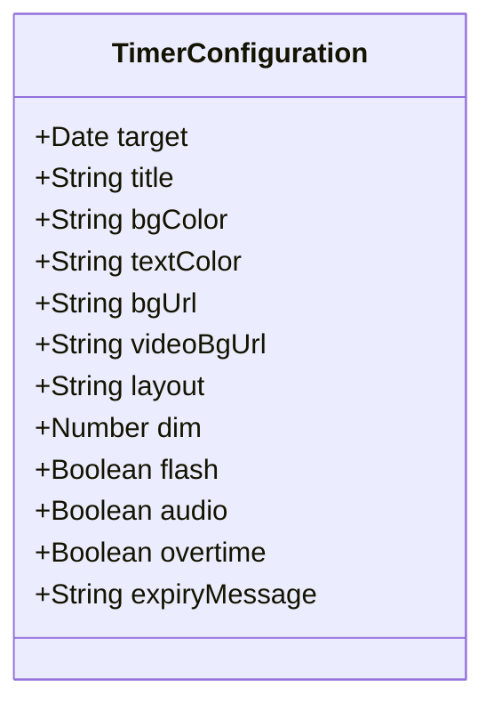

# Data Model: Custom Expiry Message

This document defines the schema and validations for the client-side timer configuration model.

## Entities

### TimerConfiguration

Represents the complete configuration state of a timer instance. This is a transient, client-side entity computed from URL search query parameters.

| Field | Type | Required | Default | Validation & Constraints |
|-------|------|----------|---------|-------------------------|
| `target` | Date | Yes | N/A | Must be a valid JavaScript Date object in the future. Inferred from `timestamp` or `minutes` query parameters. |
| `title` | String | No | `null` | Sanitized text string, whitespace trimmed. |
| `bgColor` | String | No | `#0b0f19` | Must be a valid hex color string (e.g., `#ffffff` or `#0b0f19`). |
| `textColor` | String | No | `#f5f5f5` | Must be a valid hex color string. |
| `bgUrl` | String | No | `null` | Must be a valid HTTPS URL pointing to an image asset. |
| `videoBgUrl` | String | No | `null` | Must be a valid HTTPS URL pointing to a video asset. |
| `layout` | String | No | `null` | Must be one of `mobile` or `widescreen`. Defaults to responsive evaluation if not set. |
| `dim` | Number | No | `null` | Clamped to the range `[0, 1]`. |
| `flash` | Boolean | No | `false` | True if flashing is enabled on expiration. |
| `audio` | Boolean | No | `false` | True if alarm audio is enabled. |
| `overtime` | Boolean | No | `false` | True if counting up overtime on expiration is enabled. |
| `expiryMessage` | String | No | `"Time is up!"` | User-defined expiration text. Trimmed, plain-text. Fallback to `"Time is up!"` if empty, null, or whitespace-only. |

## Relationships

## State Transitions

The timer configuration exists in three primary states:
1. **Creation/Edit**: User manipulates form controls on the home screen. Fields are validated dynamically.
2. **Serialization**: The state fields are serialized into an URL search string.
3. **Execution/Expiration**: The URL is parsed to initialize the timer view. On expiration (`completed = true`), the visual layout displays `expiryMessage` instead of the segment timer stack.
